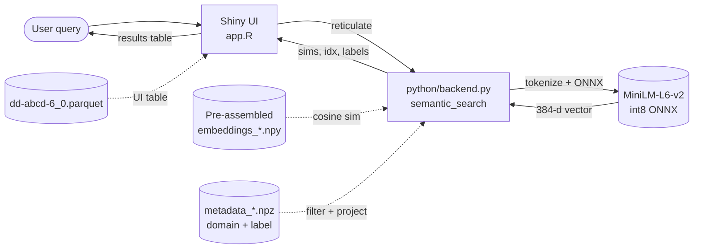
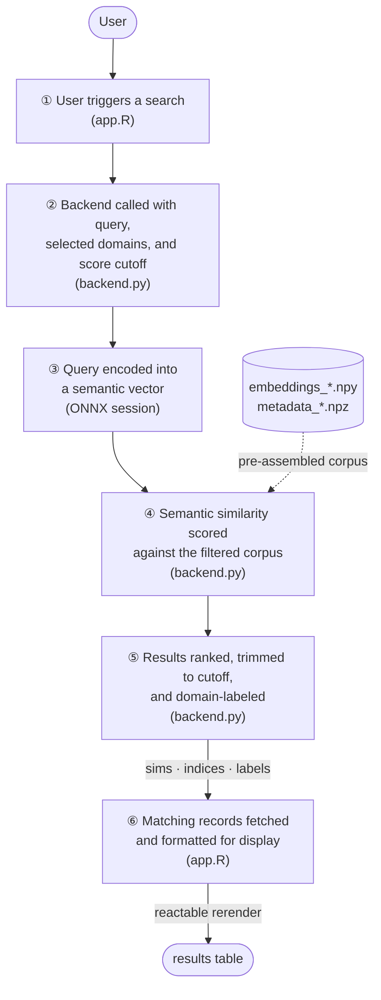

# How it works

[TOC]

## At a glance

The app has three layers:

1. **R Shiny UI** (`app.R`) — UI, filters, table display via [reactable](https://glin.github.io/reactable/), Python bridge via [reticulate](https://rstudio.github.io/reticulate/).
2. **Python search backend** (`python/backend.py`) — query encoding + cosine ranking. Pure NumPy + onnxruntime + tokenizers; no `torch` or `pandas` at runtime.
3. **Pre-assembled artifacts** (`python/model/`, `data/embeddings/`, `data/dd-abcd-6_0.parquet`) — produced once by `python/build_embeddings.py` and shipped with the deploy.

## A search, end to end

A user types *"anxiety symptoms"* and presses Enter. Here's what happens:

A few details worth knowing:

- **Indices are 0-based in Python.** R adds 1 (`indices + 1`) before subsetting `dd`. The `dd` dataframe is the parquet read by `nanoparquet`, so the schema is identical to the source CSV (44 string columns).
- **Two corpora** are pre-assembled: `noimag` (26,692 rows) and `imag` (83,206 rows, includes imaging variables). The backend picks one based on whether the user's selected domains include `"Imaging"`.
- **Single matmul.** Embeddings are L2-normalized at build time, so cosine similarity is `embeddings @ q`. The domain filter is a boolean mask applied before the matmul to avoid wasted work.

## Model choice and quality

The original implementation used `sentence-transformers/all-MiniLM-L6-v2` with PyTorch, which is too big for shinyapps.io. We benchmarked alternatives:

| Backend | Bundle cost | Query latency | Top-10 overlap vs fp32 |
|---|---|---|---|
| sentence-transformers + torch | ~500 MB | ~30 ms | 100% (baseline) |
| `model2vec` (potion-base-8M, static) | ~30 MB | <10 ms | **23%** ✗ |
| `model2vec` (potion-retrieval-32M) | ~120 MB | <10 ms | 22% ✗ |
| **MiniLM-L6-v2 ONNX int8** | **~23 MB** | **~2 ms** | **75%, 99.7% quality ratio** ✓ |

The static-embedding alternatives (`model2vec`) failed on acronym-heavy queries like `"BMI body mass index"` (returning *Glycemic Index* / *dissimilarity index* instead of weight measurements). ONNX int8 preserves the contextual encoding from the original transformer with a small quantization error.

See `sanity-chks/` in the repo for the comparison scripts.

## Bundle math

What ships to shinyapps.io:

| Item | Size |
|---|---|
| `python/model/model.onnx` (MiniLM int8) | 23.0 MB |
| `python/model/tokenizer.json` | 0.5 MB |
| `data/embeddings/embeddings_imag.npy` (fp16) | 63.9 MB |
| `data/embeddings/embeddings_noimag.npy` (fp16) | 20.5 MB |
| `data/embeddings/metadata_*.npz` (×2, domain + label arrays) | 1.0 MB |
| `data/dd-abcd-6_0.parquet` (UI table, snappy) | 7.1 MB |
| `renv.lock`, `app.R`, `python/backend.py`, etc. | <0.5 MB |
| **Total** | **~116 MB** |

Well under the 1 GB shinyapps.io free-tier bundle limit.

What does **not** ship:

- Raw source CSVs (~107 MB total) — build inputs only, excluded via `.rscignore` and `data/.rscignore`.
- `python_env/`, `renv/library/`, `sanity-chks/` — local dev only.
- `setup.sh`, `run.sh`, `deploy.sh` — dev tooling.

## Why pre-assembled artifacts

A semantic-search app like this has three big costs you have to pay somewhere:

1. **Downloading a model** (~25–500 MB depending on choice).
2. **Encoding the corpus** (one-time, ~37 s for the noimag corpus on CPU).
3. **Installing Python deps** (`torch` adds ~500 MB; `onnxruntime` adds ~15 MB).

If you do (1) and (2) at runtime, the first search takes ~60 s and shinyapps.io kills you for missing the startup window. If you ship `torch`, you blow the 1 GB bundle limit.

The whole architecture is a chain of "do this offline so the runtime is cheap":

| Cost | When it's paid | How |
|---|---|---|
| Download MiniLM weights | Local, once | `python/build_embeddings.py` downloads ONNX int8 from HF |
| Encode 26k labels | Local, once | Same script writes `embeddings_*.npy` (fp16) |
| Build the dictionary table | Local, once | Same script converts CSV → snappy Parquet |
| Install `torch` | Never | We don't use it at runtime — `onnxruntime` runs the model |
| Install `pandas` | Never | Backend uses pure NumPy + tiny `.npz` metadata |
| Install `onnxruntime`, `tokenizers`, `numpy` | First deploy + on cold instance | `reticulate::py_require()` + `uv` (~5 s) |
| Tokenize query | Per search | Tokenizers (Rust) |
| Encode query | Per search | ONNX session (~2 ms) |
| Cosine similarity | Per search | One BLAS matmul |

The build script is idempotent — re-run `./setup.sh` whenever the source CSVs change.
