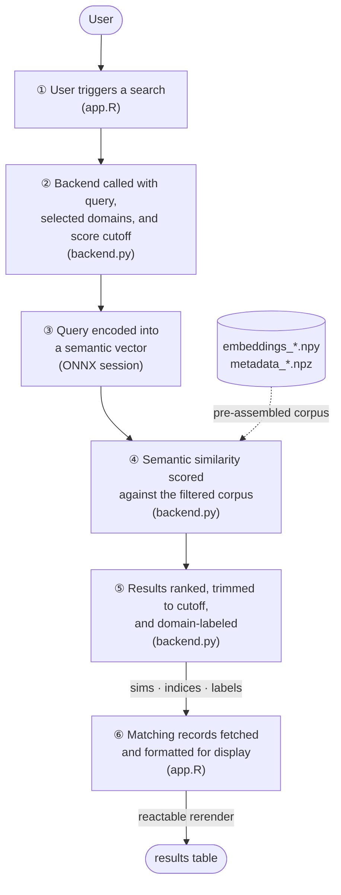

# How it works

[TOC]

## At a glance

```mermaid
flowchart LR
  user([User query]) --> ui[Shiny UI<br/>app.R]
  ui -- reticulate --> backend[python/backend.py<br/>semantic_search]
  backend -- tokenize + ONNX --> model[(MiniLM-L6-v2<br/>int8 ONNX)]
  model -- 384-d vector --> backend
  embeddings[(Pre-assembled<br/>embeddings_*.npy)] -. cosine sim .-> backend
  metadata[(metadata_*.npz<br/>domain + label)] -. filter + project .-> backend
  backend -- sims, idx, labels --> ui
  parquet[(dictionary.parquet<br/>per config.yml)] -. UI table .-> ui
  manifest[(manifest.txt)] -. drift check .-> ui
  config[(config.yml)] -. single source<br/>of truth .-> ui
  config -. .-> backend
  ui -- results table --> user
```

The app has three layers plus a config layer:

1. **R Shiny UI** (`app.R`) — UI, filters, table display via [reactable](https://glin.github.io/reactable/), Python bridge via [reticulate](https://rstudio.github.io/reticulate/).
2. **Python search backend** (`python/backend.py`) — query encoding + cosine ranking. Pure NumPy + onnxruntime + tokenizers; no `torch` or `pandas` at runtime.
3. **Pre-assembled artifacts** (`python/model/`, `data/embeddings/`, `data/<dictionary>.parquet`) — produced once by `python/build_embeddings.py` and shipped with the deploy.
4. **`config.yml` (single source of truth)** — names the active parquet release, the embedding model, and which columns to encode / keep as metadata. `setup.sh`, `build_embeddings.py`, and `app.R` all read it; `data/embeddings/manifest.txt` records which parquet the embeddings were built against so the UI can refuse to start on drift.

## A search, end to end

A user types *"anxiety symptoms"* and presses Enter. Here's what happens:

```mermaid
flowchart TD
    U(["User"])
    A["① User triggers a search<br/>(app.R)"]
    B["② Backend called with query,<br/>selected domains, and score cutoff<br/>(backend.py)"]
    C["③ Query encoded into<br/>a semantic vector<br/>(ONNX session)"]
    D["④ Semantic similarity scored<br/>against the filtered corpus<br/>(backend.py)"]
    E[("embeddings_*.npy<br/>metadata_*.npz")]
    F["⑤ Results ranked, trimmed to cutoff,<br/>and domain-labeled<br/>(backend.py)"]
    G["⑥ Matching records fetched<br/>and formatted for display<br/>(app.R)"]
    U2(["results table"])

    U --> A
    A --> B
    B --> C
    C --> D
    E -. pre-assembled corpus .-> D
    D --> F
    F -->|"sims · indices · labels"| G
    G -->|"reactable rerender"| U2
```

A few details worth knowing:

- **Indices are 0-based in Python.** R adds 1 (`indices + 1`) before subsetting the dictionary dataframe. The dataframe is the parquet read by `nanoparquet`, so the schema is identical to the source.
- **Two corpora** are pre-assembled from the same parquet at build time: `noimag` (the dictionary without rows where `domain == "Imaging"`) and `imag` (every row with a non-null label). The backend picks one based on whether the user's selected model is *"ChatBot Pro Max Ultra (all)"*.
- **Single matmul.** Embeddings are L2-normalized at build time, so cosine similarity is `embeddings @ q`. The domain filter is a boolean mask applied before the matmul to avoid wasted work.
- **Dictionary version comes from the parquet filename.** `app.R` parses `dd-abcd-X_Y.parquet` and shows `X.Y` in the page title and header banner — so the UI always reflects whatever release `config.yml` points at.
- **Drift guard.** `build_embeddings.py` writes the active parquet name into `data/embeddings/manifest.txt`. On startup `app.R` re-reads both and refuses to launch if they disagree, preventing a "config bumped, embeddings stale" failure mode where searches would return rows from the old release.

## Model choice and quality

The original implementation used `sentence-transformers/all-MiniLM-L6-v2` with PyTorch, which is too big for shinyapps.io. We benchmarked alternatives:

| Backend | Bundle cost | Query latency | Top-10 overlap vs fp32 |
|---|---|---|---|
| sentence-transformers + torch | ~500 MB | ~30 ms | 100% (baseline) |
| `model2vec` (potion-base-8M, static) | ~30 MB | <10 ms | **23%** ✗ |
| `model2vec` (potion-retrieval-32M) | ~120 MB | <10 ms | 22% ✗ |
| **MiniLM-L6-v2 ONNX int8** | **~23 MB** | **~2 ms** | **75%, 99.7% quality ratio** ✓ |

The static-embedding alternatives (`model2vec`) failed on acronym-heavy queries like `"BMI body mass index"` (returning *Glycemic Index* / *dissimilarity index* instead of weight measurements). ONNX int8 preserves the contextual encoding from the original transformer with a small quantization error.

See `sanity-chks/` in the repo for the comparison scripts.

## Bundle math (ABCD 7.0)

What ships to shinyapps.io for the active release named in `config.yml`:

| Item | Size |
|---|---|
| `python/model/model.onnx` (MiniLM int8) | 23.0 MB |
| `python/model/tokenizer.json` | 0.5 MB |
| `data/embeddings/embeddings_imag.npy` (fp16) | 68.6 MB |
| `data/embeddings/embeddings_noimag.npy` (fp16) | 27.2 MB |
| `data/embeddings/metadata_*.npz` (×2, domain + label arrays) | 1.2 MB |
| `data/embeddings/manifest.txt` (drift guard) | <1 KB |
| `data/dd-abcd-7_0.parquet` (UI table, snappy) | 5.0 MB |
| `config.yml`, `renv.lock`, `app.R`, `python/backend.py`, etc. | <0.5 MB |
| **Total** | **~125 MB** |

Well under the 1 GB shinyapps.io free-tier bundle limit.

### Versions

The dictionary release drives both the deployment bundle size and the runtime memory footprint. Comparison of the current build (ABCD 7.0) against the previously shipped build (6.0):

#### Bundled data on disk (`data/`)

| File                      |     6.0      |     7.0      |          Δ |
| ------------------------- | -----------: | -----------: | ---------: |
| `dd-abcd-*.parquet`       | 6.75 MB      | 5.01 MB      | −1.74 MB   |
| `embeddings_imag.npy`     | 60.94 MB     | 68.63 MB     | +7.69 MB   |
| `embeddings_noimag.npy`   | 19.55 MB     | 27.15 MB     | +7.60 MB   |
| `metadata_imag.npz`       | 0.64 MB      | 0.77 MB      | +0.13 MB   |
| `metadata_noimag.npz`     | 0.26 MB      | 0.39 MB      | +0.13 MB   |
| **Total bundled data**    | **88.14 MB** | **101.95 MB** | **+13.81 MB (+15.7%)** |

The 7.0 parquet is smaller despite containing more rows (fewer columns retained / better compression).

#### Embedding matrices in RAM (float16, 384-dim)

| Corpus | 6.0 shape    | 7.0 shape    | Row Δ              | RAM Δ    |
| ------ | ------------ | ------------ | ------------------ | -------- |
| imag   | 83,206 × 384 | 93,699 × 384 | +10,493 (+12.6%)   | +7.69 MB |
| noimag | 26,692 × 384 | 37,068 × 384 | +10,376 (+38.9%)   | +7.60 MB |

Resident memory for the embedding matrices increases by ~**15.3 MB** moving from 6.0 to 7.0.

### What does **not** ship

- Raw source CSVs / non-active parquets — `deploy.sh` filters them out and `.rscignore` / `data/.rscignore` keep the rest out.
- `python_env/`, `renv/library/`, `sanity-chks/` — local dev only.
- `setup.sh`, `run.sh`, `deploy.sh` — dev tooling.

## Why pre-assembled artifacts

A semantic-search app like this has three big costs you have to pay somewhere:

1. **Downloading a model** (~25–500 MB depending on choice).
2. **Encoding the corpus** (one-time, ~40 s for the noimag corpus on CPU).
3. **Installing Python deps** (`torch` adds ~500 MB; `onnxruntime` adds ~15 MB).

If you do (1) and (2) at runtime, the first search takes ~60 s and shinyapps.io kills you for missing the startup window. If you ship `torch`, you blow the 1 GB bundle limit.

The whole architecture is a chain of "do this offline so the runtime is cheap":

| Cost | When it's paid | How |
|---|---|---|
| Download MiniLM weights | Local, once | `python/build_embeddings.py` downloads ONNX int8 from HF (path from `config.yml`) |
| Encode the corpus | Local, once | Same script writes `embeddings_*.npy` (fp16) |
| Build the dictionary table | Local, once (handled outside this repo) | Drop a `dd-abcd-X_Y.parquet` in `data/`; point `config.yml` at it |
| Install `torch` | Never | We don't use it at runtime — `onnxruntime` runs the model |
| Install `pandas` | Never | Backend uses pure NumPy + tiny `.npz` metadata |
| Install `onnxruntime`, `tokenizers`, `numpy` | First deploy + on cold instance | `reticulate::py_require()` + `uv` (~5 s) |
| Tokenize query | Per search | Tokenizers (Rust) |
| Encode query | Per search | ONNX session (~2 ms) |
| Cosine similarity | Per search | One BLAS matmul |

The build script is idempotent — re-run `./setup.sh` whenever `config.yml` or the dictionary parquet changes.
